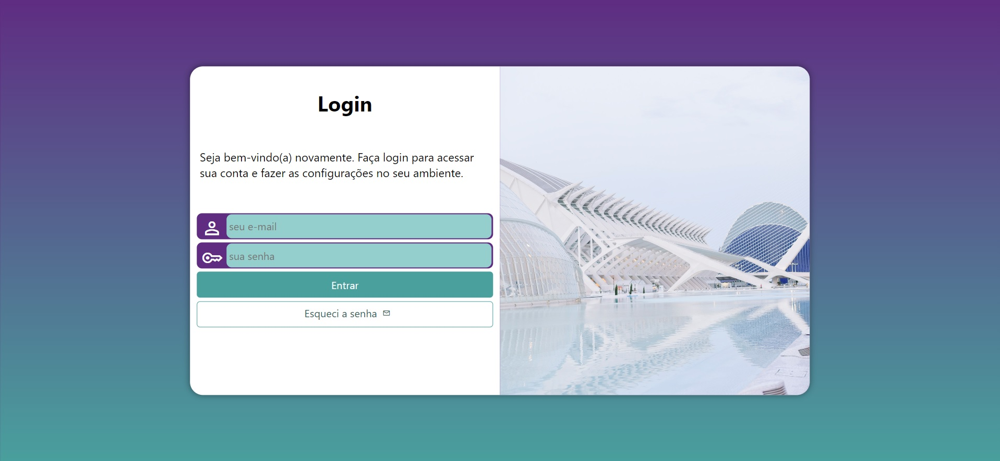

<h1 align="center"> Projeto Login </h1>

O projeto Login foi desenvolvido durante o curso de HTML5 e CSS3 do Curso em Vídeo.  

  <a href="#-tecnologias">Tecnologias</a>&nbsp;&nbsp;&nbsp;|&nbsp;&nbsp;&nbsp;
  <a href="#-projeto">Projeto</a>&nbsp;&nbsp;&nbsp;|&nbsp;&nbsp;&nbsp;
  <a href="#memo-licença">Licença</a>

  

 

  

## 🚀 Tecnologias

Esse projeto foi desenvolvido com as seguintes tecnologias:

- HTML
- CSS
- JavaScript
- Git e Github

## 💻 Projeto

O Projeto Login é uma landing page para um site onde é possível fazer seu login com e-mail e senha, disponível em versões para celular, tablet e dektop ou TV's.

## :memo: Licença

Esse projeto está sob a licença MIT.

---

Feito pelo curso de HTML5 e CSS3 do Curso em Vídeo do professor Gustavo Guanabara.
